# 翻译脚本使用指南 / Translation Scripts Guide

本目录包含3个自动化翻译脚本，帮助您管理多语言内容。

This directory contains 3 automated translation scripts to help manage multilingual content.

---

## 📁 项目架构说明 / Project Architecture

本项目使用 **Next.js App Router** + **next-intl** 实现国际化，遵循最佳实践目录结构。

This project uses **Next.js App Router** + **next-intl** for internationalization following best practices.

### 目录结构 / Directory Structure

```
easynanobanana.com/
├── src/
│   ├── app/
│   │   └── [locale]/              # 动态路由：支持多语言
│   │       ├── page.tsx           # 首页
│   │       ├── about/page.tsx     # 关于页面
│   │       ├── pricing/page.tsx   # 定价页面
│   │       └── ...                # 其他页面
│   │
│   └── i18n/                      # 国际化配置
│       ├── config.ts              # 语言配置（13种语言）
│       ├── routing.ts             # 路由配置
│       └── request.ts             # 请求处理
│
├── messages/                      # 翻译文件（JSON格式）
│   ├── en.json                    # 英文（源语言）
│   ├── zh.json                    # 简体中文
│   ├── ja.json                    # 日语
│   ├── ko.json                    # 韩语
│   ├── de.json                    # 德语
│   ├── es.json                    # 西班牙语
│   ├── fr.json                    # 法语
│   ├── it.json                    # 意大利语
│   ├── pt.json                    # 葡萄牙语
│   ├── ru.json                    # 俄语
│   ├── th.json                    # 泰语
│   ├── id.json                    # 印尼语
│   ├── vi.json                    # 越南语
│   └── zh-TW.json                 # 繁体中文
│
└── scripts/                       # 翻译自动化脚本
    ├── translate.ts               # 单语言翻译
    ├── translate-batch.ts         # 批量翻译
    ├── sync-translations.ts       # 同步key结构
    └── README.md                  # 本文档
```

### next-intl 配置要点 / next-intl Configuration

**1. 语言配置** (`src/i18n/config.ts`)
```typescript
export const locales = ['en', 'zh', 'de', 'fr', 'ja', 'pt', 'es', 'it', 'ru', 'ko', 'th', 'id', 'vi'];
export const defaultLocale = 'en';
```

**2. 路由配置** (`src/i18n/routing.ts`)
```typescript
export const routing = defineRouting({
  locales,
  defaultLocale,
  localePrefix: 'as-needed'  // 英文不带前缀，其他语言带前缀
});
```

**3. URL 结构**
- 英文（默认）：`https://easynanobanana.com/pricing`
- 中文：`https://easynanobanana.com/zh/pricing`
- 日语：`https://easynanobanana.com/ja/pricing`

**4. 翻译文件格式** (`messages/en.json`)
```json
{
  "home": {
    "title": "Welcome to Nano Banana",
    "description": "AI-powered image generation platform"
  },
  "pricing": {
    "title": "Pricing Plans",
    "monthly": "Monthly",
    "credits": "{count} credits"
  }
}
```

**5. 组件中使用翻译**
```tsx
import { useTranslations } from 'next-intl';

export default function Page() {
  const t = useTranslations('home');

  return (
    <div>
      <h1>{t('title')}</h1>
      <p>{t('description')}</p>
    </div>
  );
}
```

### 翻译工作流程 / Translation Workflow

```mermaid
graph LR
    A[修改 en.json] --> B[运行 sync-translations]
    B --> C[同步到所有语言文件]
    C --> D[运行 translate:incremental]
    D --> E[AI翻译缺失内容]
    E --> F[人工审核调整]
```



---

## 🎯 第一次使用？/ First Time User?

**三步完成配置**：

1. 安装依赖：`pnpm install`
2. 配置密钥：在 `.env.local` 添加 `OPENROUTER_API_KEY=你的密钥`
3. 开始翻译：`pnpm translate:incremental`

👉 获取密钥：访问 [OpenRouter](https://openrouter.ai/) 注册

---

## ⚡ 最常用命令 / Most Used Commands

**配置好环境变量后直接使用**：

### 1️⃣ 同步翻译key结构（不消耗API额度）
```bash
pnpm sync-translations
```
**作用**：将英文文件新增的key同步到所有其他语言文件，用英文占位

**适用场景**：在 `messages/en.json` 添加新key后，想快速同步结构

---

### 2️⃣ 完整翻译所有语言
```bash
pnpm translate:all
```
**作用**：依次翻译所有12种语言（完整翻译，会覆盖已有内容）

**适用场景**：首次翻译或需要重新翻译所有内容

**⚠️ 注意**：会消耗较多API额度，耗时较长（约5-10分钟）

---

### 3️⃣ 增量翻译所有语言（推荐）
```bash
pnpm translate:incremental
```
**作用**：只翻译所有语言中缺失或未翻译的内容

**适用场景**：日常更新翻译，节省API费用

**✅ 推荐工作流**：
```bash
# 1. 先同步key结构
pnpm sync-translations

# 2. 增量翻译缺失内容
pnpm translate:incremental
```

---

## 📦 准备工作 / Setup

### 1. 安装依赖 / Install Dependencies

```bash
pnpm install
```

所需依赖（已添加到 `package.json`）/ Required packages:
- `dotenv` - 加载环境变量 / Load environment variables
- `openai` - OpenAI SDK（用于调用翻译API）/ For translation API calls
- `tsx` - TypeScript 执行引擎 / TypeScript execution engine

### 2. 配置环境变量 / Configure Environment Variables

在项目根目录的 `.env.local` 文件中添加以下配置：

Add these to your `.env.local` file in the project root:

```bash
OPENROUTER_API_KEY=your_openrouter_api_key_here
OPENROUTER_SITE_URL=https://www.easynanobanana.com  # 可选 / Optional
OPENROUTER_SITE_NAME=Nano Banana                    # 可选 / Optional
```

获取 API Key：访问 [OpenRouter](https://openrouter.ai/) 注册并获取密钥。

Get an API key from [OpenRouter](https://openrouter.ai/).

---

## 🔧 进阶使用 / Advanced Usage

### 可用的所有命令 / All Available Commands

| 命令 Command | 说明 Description |
|-------------|------------------|
| `pnpm sync-translations` | 同步key结构（不翻译） |
| `pnpm translate:all` | 完整翻译所有语言 |
| `pnpm translate:incremental` | 增量翻译所有语言 |
| `pnpm translate:new` | 只翻译新增key |
| `pnpm translate:batch` | 批量翻译（可自定义参数） |
| `pnpm translate <locale>` | 翻译单个语言 |

---

## 🚀 脚本详细介绍 / Scripts Overview

### 1️⃣ `translate.ts` - 单语言翻译脚本

**作用**：翻译单个语言

**用法**：
```bash
pnpm translate <语言代码>
```

**示例**：
```bash
pnpm translate zh        # 翻译成简体中文
pnpm translate ja        # 翻译成日语
pnpm translate es        # 翻译成西班牙语
```

**高级选项**：

- **增量翻译**（只翻译缺失的内容）：
  ```bash
  pnpm translate zh -- --incremental
  ```
  适用场景：在英文文件里新增了几个翻译key，只想翻译新增的部分

- **仅翻译新增的 key**（更精准的增量翻译）：
  ```bash
  pnpm translate zh -- --new-only
  ```
  适用场景：只想翻译目标语言文件中完全不存在的新key，忽略已有但未翻译的key

---

### 2️⃣ `translate-batch.ts` - 批量翻译脚本

**作用**：一次性翻译多个语言（可以节省时间）

**用法**：

1. **翻译所有语言**（默认12种语言）：
   ```bash
   pnpm translate:batch
   ```

2. **翻译指定的几种语言**：
   ```bash
   pnpm translate:batch zh ja ko
   ```

3. **增量批量翻译**（只翻译缺失内容）：
   ```bash
   pnpm translate:batch -- --incremental
   ```

4. **并行翻译**（更快，但需要更多API配额）：
   ```bash
   pnpm translate:batch -- --parallel
   ```

5. **组合使用**：
   ```bash
   pnpm translate:batch zh ja -- --incremental --parallel
   ```

**输出示例**：
```
╔═══════════════════════════════════════════════════════╗
║         Batch Translation Script                      ║
╚═══════════════════════════════════════════════════════╝

Languages to translate: zh, de, es, fr, it, pt, ja, ko, ru, vi, th, id
Mode: Incremental
Execution: Sequential

━━━ Starting translation for zh ━━━
✓ zh translation completed successfully

━━━ Starting translation for de ━━━
✓ de translation completed successfully
...

╔═══════════════════════════════════════════════════════╗
║                   Summary Report                      ║
╚═══════════════════════════════════════════════════════╝

Total: 12 languages
✓ Successful: 12
Total time: 123.45s
```

---

### 3️⃣ `sync-translations.ts` - 翻译同步脚本

**作用**：将英文文件中的新key同步到所有其他语言文件（不调用翻译API）

**用法**：
```bash
pnpm tsx scripts/sync-translations.ts
```

**工作原理**：
1. 读取 `messages/en.json`（英文源文件）
2. 对比所有其他语言文件（`zh.json`, `ja.json` 等）
3. 将缺失的 key 填充到其他语言文件中
4. **注意**：新增的 key 会直接使用英文内容作为占位符

**使用场景**：
- 在英文文件中新增了翻译key
- 想快速将这些key同步到所有语言文件
- 稍后再用 `translate-batch.ts` 进行实际翻译

**输出示例**：
```
🔄 Starting translation sync...

📝 Processing zh.json...
  ✅ Added 5 missing key(s)

📝 Processing ja.json...
  ✨ No missing keys

📊 Summary:
  Total files processed: 12
  Total keys added: 15

📋 Details:

  zh.json (5 keys):
    - home.newFeature.title
    - home.newFeature.description
    - pricing.planName

⚠️  Note: Missing keys have been filled with English text.
   Please translate them to the appropriate language.

✅ Translation sync completed!
```

---

## 🌍 支持的语言 / Supported Languages

| 代码 Code | 语言 Language        | 使用示例 Example            |
|-----------|---------------------|----------------------------|
| `zh`      | 简体中文             | `pnpm translate zh`        |
| `zh-TW`   | 繁体中文             | `pnpm translate zh-TW`     |
| `ja`      | 日语                | `pnpm translate ja`        |
| `ko`      | 韩语                | `pnpm translate ko`        |
| `de`      | 德语                | `pnpm translate de`        |
| `es`      | 西班牙语             | `pnpm translate es`        |
| `fr`      | 法语                | `pnpm translate fr`        |
| `it`      | 意大利语             | `pnpm translate it`        |
| `pt`      | 葡萄牙语             | `pnpm translate pt`        |
| `ru`      | 俄语                | `pnpm translate ru`        |
| `vi`      | 越南语              | `pnpm translate vi`        |
| `th`      | 泰语                | `pnpm translate th`        |
| `id`      | 印尼语              | `pnpm translate id`        |

---

## 📋 常见使用场景 / Common Use Cases

### 场景 1：新增功能，需要翻译新的文本

**步骤**：

1. 在 `messages/en.json` 中添加新的翻译key：
   ```json
   {
     "newFeature": {
       "title": "Amazing Feature",
       "description": "This feature will change your life"
     }
   }
   ```

2. 方式A - 使用同步脚本 + 批量翻译（推荐）：
   ```bash
   # 第1步：同步key到所有语言文件（会用英文占位）
   pnpm tsx scripts/sync-translations.ts

   # 第2步：批量翻译所有缺失内容
   pnpm translate:batch -- --incremental
   ```

3. 方式B - 直接批量翻译：
   ```bash
   pnpm translate:batch -- --new-only
   ```

---

### 场景 2：只翻译某个特定语言

```bash
# 完整翻译中文
pnpm translate zh

# 增量翻译中文（只翻译缺失部分）
pnpm translate zh -- --incremental
```

---

### 场景 3：检查哪些语言缺少翻译

```bash
# 运行同步脚本，会显示每个语言缺少多少个key
pnpm tsx scripts/sync-translations.ts
```

---

### 场景 4：修复某个语言的翻译错误

如果发现某个翻译有问题：

1. 直接修改对应语言的JSON文件（如 `messages/zh.json`）
2. 或者删除该key，然后运行增量翻译重新生成

---

## 🔧 工作原理 / How It Works

1. **源文件**：所有翻译都基于 `messages/en.json`（英文）
2. **翻译引擎**：使用 OpenRouter API 调用 GPT-4.1-mini 模型
3. **输出位置**：翻译结果保存到 `messages/<语言代码>.json`
4. **结构保持**：
   - ✅ 保留 JSON 嵌套结构
   - ✅ 保留占位符变量（如 `{count}`, `{name}`）
   - ✅ 保留 Markdown 语法
   - ✅ 只翻译文本内容，不翻译key名称

---

## ⚠️ 常见问题 / Troubleshooting

### 错误：Missing OPENROUTER_API_KEY

**原因**：未配置环境变量

**解决**：在 `.env.local` 文件中添加 `OPENROUTER_API_KEY=你的密钥`

---

### 翻译质量不理想

**解决方案**：

1. 自动翻译仅供参考，建议人工审核
2. 对于重要内容，手动调整翻译文件
3. 可以在 `translate.ts:93` 修改模型为更强大的版本（如 `gpt-4o`）

---

### 某个语言文件缺少很多key

**解决**：

```bash
# 先同步key结构
pnpm tsx scripts/sync-translations.ts

# 再进行增量翻译
pnpm translate <语言代码> -- --incremental
```

---

## 💡 最佳实践 / Best Practices

1. **英文是源头**：永远先更新 `messages/en.json`，再翻译到其他语言
2. **使用增量模式**：避免重复翻译已有内容，节省API费用
3. **人工审核**：自动翻译后，检查关键页面的翻译质量
4. **版本控制**：提交所有翻译文件到Git，方便回溯
5. **测试界面**：在浏览器中切换语言，确保UI显示正常

---

## 📝 文件结构 / File Structure

```
scripts/
├── translate.ts           # 单语言翻译脚本
├── translate-batch.ts     # 批量翻译脚本
├── sync-translations.ts   # 同步key结构（不翻译）
└── README.md             # 本文档

messages/
├── en.json               # 英文源文件（所有翻译的基础）
├── zh.json               # 简体中文
├── ja.json               # 日语
├── ko.json               # 韩语
└── ...                   # 其他语言文件
```

---

---

## 📝 完整示例 / Complete Example

**场景：添加新功能需要更新翻译**

```bash
# 步骤1：修改英文翻译文件
# 编辑 messages/en.json，添加新的翻译key

# 步骤2：同步key到所有语言
pnpm sync-translations

# 步骤3：增量翻译所有语言
pnpm translate:incremental

# 完成！所有语言文件都已更新
```

---

需要帮助？查看脚本源代码或联系团队成员。

Need help? Check the script source code or contact the team.
